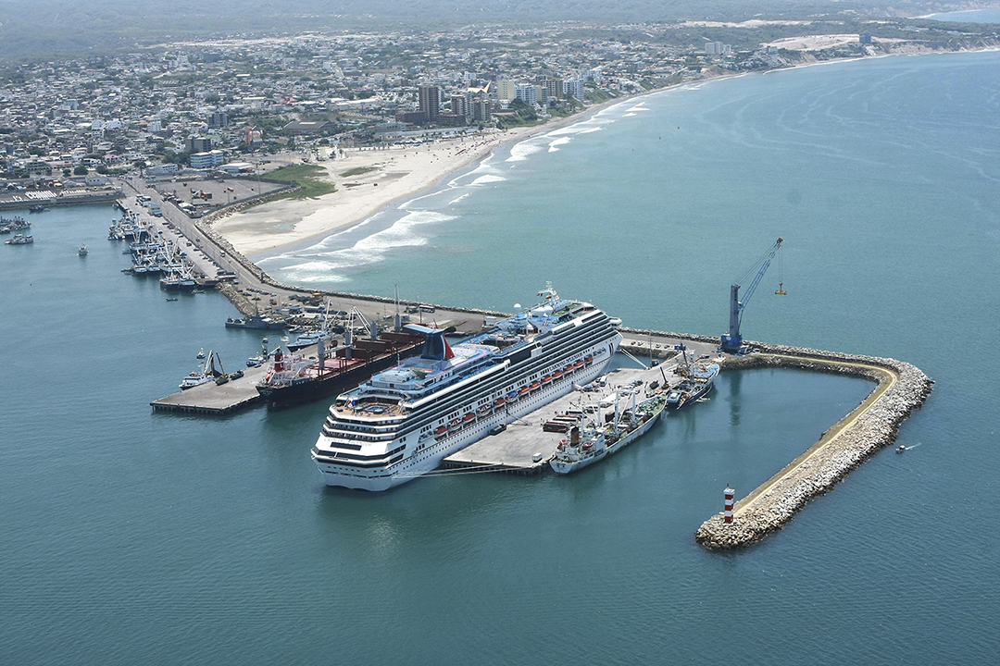

# Agencia de Turismo - Descubre Manta

**Nombre del estudiante:** Odalys Seraquive
**Destino turístico asignado:** Manta - Manabí

**Descripción del proyecto:** 
Portal web desarrollado para la agencia de turismo ficticia "Descubre Manta". El sitio está enfocado en promocionar las playas, la gastronomía local, el turismo urbano, la oferta hotelera y las actividades marítimas del cantón Manta. Cuenta con 5 páginas navegables que incluyen atractivos turísticos, paquetes de servicios, información institucional y un formulario de reservas.

**Tecnologías utilizadas:** 
* HTML5 (Estructura semántica y validación de formularios)
* CSS3 (Flexbox, CSS Grid, Box Model, Media Queries para diseño responsive)
* Git y GitHub
* GitHub Pages

**Captura del sitio:**
 
*(Nota: Aquí se muestra temporalmente la imagen del hero. Una vez tomes la captura real de tu página index.html, reemplaza hero.jpg con el nombre de tu captura).*

**URL del sitio publicado:**
[https://TU-USUARIO.github.io/agencia-turismo/](https://TU-USUARIO.github.io/agencia-turismo/)
*(Nota: Recuerda cambiar "TU-USUARIO" por tu usuario real de GitHub una vez lo publiques).*
Recordar